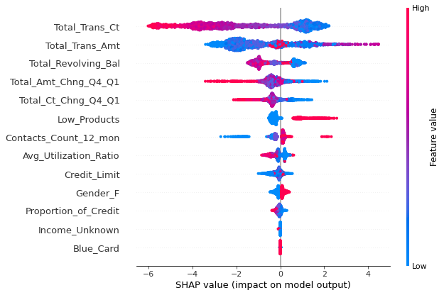

# Piotto Pierfrancesco

### Recent Projects

## Project 1: [Customer Churn Analysis and Explanation - Project Overview](https://www.kaggle.com/pier994/interpretable-customer-churn-analysis)
It is an end to end data science notebook, with exclusion of development. The task is to create an algorithm that predicts which customers are churn-prone in a banking framework. The main steps in the notebook are:
* Preliminary EDA performed using seaborn and matplotlib for visualization, scipy for statistical methods (such as chi squared and paired t test) and apriori algorithm for the detection of the most important features;
* Features cleaning and engineering according to evidence gained and intuition;
* Built a first machine learning pipeline using decision trees. The choice for this particular algorithm is due to interpretability and various imbalance handling techniques are exploited;
* Built a second Machine Learning pipeline with XGBoost optimized using Random Search Cross Validation to reach the best model. The best threshold has been detected by maximizing the F1 score;
* Explaining the latter model using SHAP, to understand the output and to gain insights to be used for business decisions.

## Project 2: [CNN for Leaf Desease classification competition](https://www.kaggle.com/pier994/how-to-build-a-simple-cnn-for-image-recognition)
This is a notebook describing a pipeline for building a Convolutional Neural Network with PyTorch. This algorithm is built on top of [Cassava Leaf Disease](https://www.kaggle.com/c/cassava-leaf-disease-classification) Kaggle competition. Besides CNN construction, data augmentation, transfer learning and ensemble methods are exploited.  
All these features and capabilities are developed using ad-hoc Python classes and eventually assembled in the training stage.
Other features:
* Used a cross validation strategy using to train 5 base learners in the same script;
* Model trained using adaptive learning rate and autocast for performance improvement;
* Final accuracy: 87% (winning solution is about 90% accurate).

## Project 3: [Geographical Analysis of NY House Dataset](https://www.kaggle.com/pier994/geographical-analysis-and-geopandas)
This is an Exploratory Data Analysis notebook. The main difference with the EDA of the first process is that the focus in this script is given to the geographical component of the data. Hence, besides exploring and cleaning the dataset, in this notebook:
* Explored and cleaned the dataset;
* data is visualized using seaborn and geopandas;
* Various geographical operations like intersection and proximity to subways are performed;
* Plots of house prices according to variables built above (neighborhood or subway proximity aggregation) are visualized.
